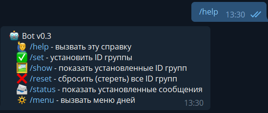
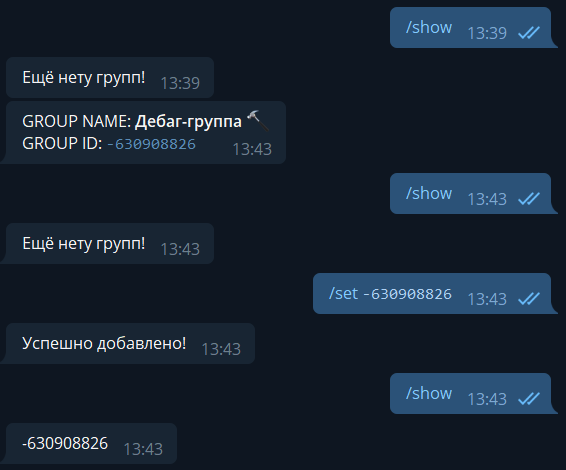
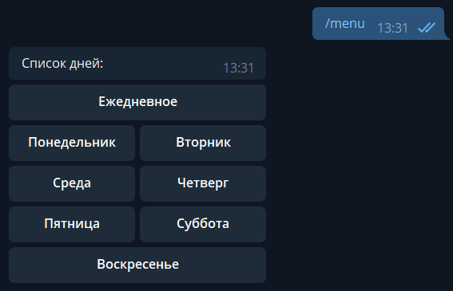
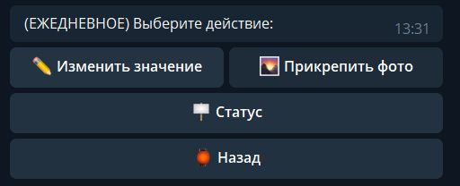
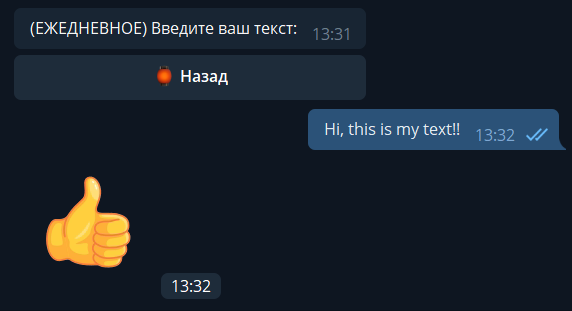

# Telegram message sender to groups

## Used libraries:
> aiogram

> aioschedule

## Installing modules:
```
sudo apt update -y && sudo apt upgrade -y
pip3 install pytelegrambotapi aiogram aioschedule
```

## Commands:
> /start

> /help


> /show (in this situation we sent this command after that we added a bot to a group)


> /menu
>> menu of days 



>> action menu



> RESULT OF SENDING


> Thanks for using! :)